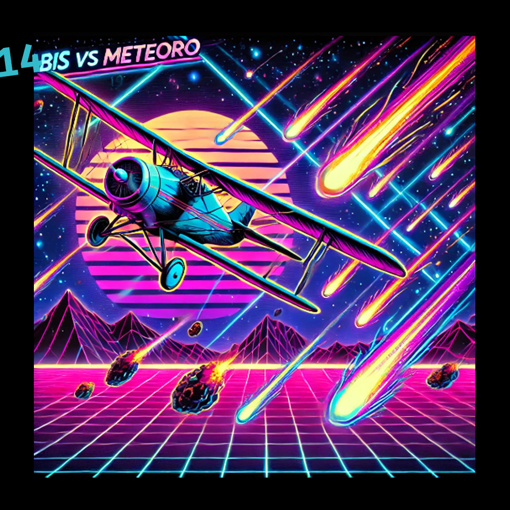
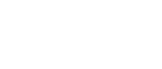

# 14bis Vs Meteoro

Bem-vindo ao 14bis Vs Meteoro - um emocionante jogo feito em Lua, onde o lendário avião 14bis enfrenta desafios cósmicos enquanto tenta evitar uma colisão com um meteoro mortal! Prepare-se para uma aventura repleta de ação, velocidade e estratégia enquanto você pilota o 14bis através do espaço sideral!

## 🎮 Como Jogar
1. **Controles**:
   - "A", "W", "S" e "D": Movimentam o 14bis.

   

   - Barra de Espaço: Dispara contra os meteoros.
   - Tecla "Esc": Pausa o jogo.

2. **Objetivo**:
   - Sobreviva o máximo possível desviando dos meteoros e atirando para destruí-los.

3. **Pontuação**:
   - A cada meteoro destruído, você ganha pontos.
   - Tente alcançar a pontuação mais alta e desafie seus amigos!

## 🛠️ Requisitos do Sistema
- Lua 5.3+
- Love2D 11.0+

## 🚀 Instalação
1. Clone o repositório para o seu computador:
- git clone https://github.com/RaphaelTW/14bis_Meteoro.git
2. Certifique-se de ter Lua e Love2D instalados na sua máquina.
3. Navegue até o diretório do jogo e execute-o com o Love2D:
- love .

## 🤝 Contribuição
Contribuições são bem-vindas! Se você encontrar algum problema, tiver ideias para melhorar o jogo, ou quiser adicionar novos recursos, sinta-se à vontade para abrir uma issue ou enviar um pull request. Toda ajuda é muito apreciada!

## 👨‍💻 Créditos
Desenvolvido por [Raphael](https://github.com/RaphaelTW).

## 📜 Licença
Este projeto é licenciado sob a [Licença MIT](https://github.com/RaphaelTW/14bis_Meteoro/blob/main/LICENSE).
